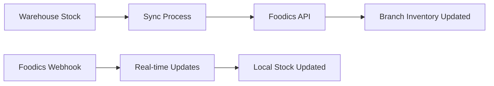

# 🚀 Complete API Integration Documentation

## Overview

Your warehouse management system now includes comprehensive API integrations with:

- **Foodics POS System Integration** - Complete synchronization with Foodics for inventory, products, and sales
- **Enhanced Warehouse Management** - Advanced multi-warehouse operations with shop integration
- **Purchase Order System** - Complete supplier management with Arabic cheque generation
- **Advanced Reporting & Analytics** - Comprehensive reporting with global search and data export
- **Real-time Webhooks** - Live updates from external systems

---

## 🎯 Quick Start

### 1. Setup Database Tables
```bash
python complete_api_integration_setup.py
```

### 2. Start the Server
```bash
python main.py
# or
uvicorn main:app --host 0.0.0.0 --port 8000 --reload
```

### 3. Configure Foodics Integration
```bash
curl -X POST "http://localhost:8000/api/foodics/configure" \
  -H "Content-Type: application/x-www-form-urlencoded" \
  -H "Authorization: Bearer YOUR_ACCESS_TOKEN" \
  -d "api_token=YOUR_FOODICS_API_TOKEN"
```

---

## 🔗 API Endpoints Reference

### Foodics Integration

#### Configure Foodics Credentials
```http
POST /api/foodics/configure
Content-Type: application/x-www-form-urlencoded
Authorization: Bearer YOUR_ACCESS_TOKEN

api_token=YOUR_FOODICS_API_TOKEN
```

#### Get Integration Status
```http
GET /api/foodics/status
Authorization: Bearer YOUR_ACCESS_TOKEN
```

#### Get Available Branches
```http
GET /api/foodics/branches
Authorization: Bearer YOUR_ACCESS_TOKEN
```

#### Get Products for Branch
```http
GET /api/foodics/products/{branch_id}
Authorization: Bearer YOUR_ACCESS_TOKEN
```

#### Sync Products with Foodics
```http
POST /api/foodics/sync-products/{branch_id}
Authorization: Bearer YOUR_ACCESS_TOKEN
```

#### Sync Inventory with Foodics
```http
POST /api/foodics/sync-inventory/{shop_id}
Authorization: Bearer YOUR_ACCESS_TOKEN
```

#### Get Sales Data
```http
GET /api/foodics/sales-data/{shop_id}?start_date=2024-01-01T00:00:00&end_date=2024-01-31T23:59:59
Authorization: Bearer YOUR_ACCESS_TOKEN
```

#### Webhook Endpoint (for Foodics)
```http
POST /api/foodics/webhook
Content-Type: application/json

{
  "type": "order.created",
  "data": {
    "order_id": "123456",
    "total": 150.00,
    "items": [...]
  }
}
```

### Enhanced Reporting

#### Inventory Summary Report
```http
GET /api/reports/inventory-summary?warehouse_id=1&category_id=2&low_stock_only=true
Authorization: Bearer YOUR_ACCESS_TOKEN
```

**Response:**
```json
{
  "success": true,
  "summary": {
    "total_items": 45,
    "total_inventory_value": 15750.50,
    "low_stock_items": 8,
    "out_of_stock_items": 2,
    "in_stock_items": 35
  },
  "items": [
    {
      "warehouse_id": 1,
      "warehouse_name": "Main Warehouse",
      "item_id": 15,
      "item_name": "Flour",
      "unit": "kg",
      "category_name": "Raw Materials",
      "current_stock": 45.5,
      "min_stock_level": 20.0,
      "stock_status": "In Stock",
      "average_cost": 2.50,
      "total_value": 113.75
    }
  ]
}
```

#### Purchase Analysis Report
```http
GET /api/reports/purchase-analysis?supplier_id=5&start_date=2024-01-01&end_date=2024-12-31
Authorization: Bearer YOUR_ACCESS_TOKEN
```

**Response:**
```json
{
  "success": true,
  "summary": {
    "total_suppliers": 12,
    "total_spent": 25750.00,
    "total_orders": 84,
    "average_order_value": 306.55
  },
  "suppliers": [
    {
      "supplier_id": 5,
      "supplier_name": "ABC Supplies Co.",
      "total_orders": 15,
      "total_spent": 8750.00,
      "average_order_value": 583.33,
      "completed_orders": 12,
      "pending_orders": 3,
      "first_order_date": "2024-01-15",
      "last_order_date": "2024-12-01"
    }
  ]
}
```

### Global Search

#### Search Across All Entities
```http
GET /api/search/global?q=flour&search_type=items&limit=20
Authorization: Bearer YOUR_ACCESS_TOKEN
```

**Response:**
```json
{
  "success": true,
  "query": "flour",
  "total_results": 8,
  "results": {
    "items": [
      {
        "id": 15,
        "name": "All-Purpose Flour",
        "unit": "kg",
        "category": "Raw Materials",
        "total_stock": 145.5
      }
    ],
    "suppliers": [],
    "purchase_orders": [],
    "cheques": []
  }
}
```

### Data Export

#### Export Inventory as CSV
```http
GET /api/export/inventory-csv?warehouse_id=1
Authorization: Bearer YOUR_ACCESS_TOKEN
```

Returns a CSV file with inventory data.

---

## 🏪 Shop Integration with Foodics

### Setting Up Shop Integration

1. **Create a Shop Warehouse:**
```http
POST /api/warehouse/warehouses
Authorization: Bearer YOUR_ACCESS_TOKEN
Content-Type: application/json

{
  "name": "Downtown Bakery Shop",
  "location": "123 Main Street",
  "is_shop": true,
  "foodics_branch_id": "branch_12345",
  "auto_sync": true
}
```

2. **Configure Auto-Sync:**
The system will automatically sync inventory between your warehouse and Foodics every hour when `auto_sync` is enabled.

3. **Manual Sync:**
```http
POST /api/foodics/sync-inventory/1
Authorization: Bearer YOUR_ACCESS_TOKEN
```

### Inventory Sync Flow



---

## 📊 Webhook Integration

### Setting Up Webhooks in Foodics

1. **In your Foodics dashboard:**
   - Go to Settings → Webhooks
   - Add webhook URL: `https://yourdomain.com/api/foodics/webhook`
   - Select events: `order.created`, `product.updated`, `inventory.updated`

2. **Supported Webhook Types:**
   - `order.created` - New orders from Foodics
   - `product.updated` - Product changes in Foodics
   - `inventory.updated` - Inventory level changes

### Webhook Security

Webhooks are automatically logged for debugging:
```sql
SELECT * FROM foodics_webhook_logs 
WHERE webhook_type = 'order.created' 
ORDER BY received_at DESC;
```

---

## 🔧 Configuration Management

### API Configuration Table

The system stores configurations in the `api_configurations` table:

```sql
-- View current configurations
SELECT * FROM api_configurations;

-- Update a configuration
UPDATE api_configurations 
SET config_value = '7200' 
WHERE config_key = 'foodics_sync_interval';
```

### Default Configurations

| Key | Default Value | Description |
|-----|---------------|-------------|
| `foodics_sync_interval` | 3600 | Sync interval in seconds |
| `max_search_results` | 100 | Max search results |
| `api_rate_limit_per_hour` | 1000 | API rate limit |
| `webhook_retry_attempts` | 3 | Webhook retry count |
| `auto_sync_enabled` | true | Enable auto sync |
| `low_stock_threshold` | 10 | Low stock alert level |

---

## 📈 Monitoring & Analytics

### System Health Monitoring

```http
GET /api/reports/system-health
Authorization: Bearer YOUR_ACCESS_TOKEN
```

### API Usage Analytics

```sql
-- Top used endpoints
SELECT endpoint, COUNT(*) as request_count, 
       AVG(response_time_ms) as avg_response_time
FROM api_usage_logs 
WHERE created_at >= DATE_SUB(NOW(), INTERVAL 24 HOUR)
GROUP BY endpoint 
ORDER BY request_count DESC;
```

### Search Analytics

```sql
-- Popular search terms
SELECT search_query, COUNT(*) as search_count,
       AVG(results_count) as avg_results
FROM search_analytics 
WHERE created_at >= DATE_SUB(NOW(), INTERVAL 7 DAY)
GROUP BY search_query 
ORDER BY search_count DESC;
```

---

## 🛠 Advanced Usage Examples

### 1. Automated Daily Inventory Sync

```python
import requests
import schedule
import time

def daily_sync():
    shops = [1, 2, 3]  # Shop warehouse IDs
    for shop_id in shops:
        response = requests.post(
            f"http://localhost:8000/api/foodics/sync-inventory/{shop_id}",
            headers={"Authorization": "Bearer YOUR_TOKEN"}
        )
        print(f"Shop {shop_id} sync: {response.json()}")

schedule.every().day.at("09:00").do(daily_sync)

while True:
    schedule.run_pending()
    time.sleep(60)
```

### 2. Low Stock Alert System

```python
import requests

def check_low_stock():
    response = requests.get(
        "http://localhost:8000/api/reports/inventory-summary?low_stock_only=true",
        headers={"Authorization": "Bearer YOUR_TOKEN"}
    )
    
    data = response.json()
    if data["summary"]["low_stock_items"] > 0:
        # Send alert (email, SMS, etc.)
        send_low_stock_alert(data["items"])

def send_low_stock_alert(items):
    for item in items:
        print(f"LOW STOCK ALERT: {item['item_name']} - Only {item['current_stock']} {item['unit']} remaining")
```

### 3. Sales Performance Dashboard

```python
from datetime import datetime, timedelta
import requests

def get_sales_performance():
    end_date = datetime.now()
    start_date = end_date - timedelta(days=7)
    
    shops = [1, 2, 3]
    total_revenue = 0
    
    for shop_id in shops:
        response = requests.get(
            f"http://localhost:8000/api/foodics/sales-data/{shop_id}",
            params={
                "start_date": start_date.isoformat(),
                "end_date": end_date.isoformat()
            },
            headers={"Authorization": "Bearer YOUR_TOKEN"}
        )
        
        data = response.json()
        if data["success"]:
            revenue = data["summary"]["total_revenue"]
            total_revenue += revenue
            print(f"Shop {shop_id}: ${revenue:.2f}")
    
    print(f"Total Revenue (7 days): ${total_revenue:.2f}")
```

---

## 🔐 Security Features

### 1. Encrypted Credential Storage
- API tokens are encrypted using Fernet encryption
- Encryption key derived from system SECRET_KEY

### 2. Authentication Required
- All endpoints require valid JWT token
- User permissions are checked for sensitive operations

### 3. Rate Limiting
- API usage is tracked and limited
- Configurable limits per user/endpoint

### 4. Audit Logging
- All API calls are logged with user details
- Change tracking for critical operations

---

## 🐛 Troubleshooting

### Common Issues

1. **Foodics API Token Invalid**
   ```json
   {
     "detail": "Invalid API token. Please check your credentials."
   }
   ```
   **Solution:** Verify your Foodics API token and reconfigure.

2. **Sync Failing**
   ```json
   {
     "success": false,
     "error": "Shop not found or not linked to Foodics"
   }
   ```
   **Solution:** Ensure warehouse has `is_shop=true` and valid `foodics_branch_id`.

3. **Webhook Not Received**
   - Check webhook URL is accessible from internet
   - Verify webhook endpoint in Foodics dashboard
   - Check `foodics_webhook_logs` table for errors

### Debug Commands

```sql
-- Check Foodics configuration
SELECT * FROM foodics_tokens WHERE is_active = 1;

-- Check recent sync logs
SELECT * FROM foodics_sync_logs ORDER BY started_at DESC LIMIT 10;

-- Check webhook logs
SELECT * FROM foodics_webhook_logs ORDER BY received_at DESC LIMIT 20;

-- Check API usage
SELECT endpoint, COUNT(*) FROM api_usage_logs 
WHERE created_at >= DATE_SUB(NOW(), INTERVAL 1 HOUR)
GROUP BY endpoint;
```

---

## 📚 Database Schema

### New Tables Created

1. **foodics_tokens** - Encrypted API credentials
2. **foodics_webhook_logs** - Webhook activity logs
3. **foodics_product_mapping** - Product sync mappings
4. **foodics_sync_logs** - Sync operation logs
5. **transfer_templates** - Warehouse transfer templates
6. **transfer_template_items** - Template item details
7. **api_usage_logs** - API usage analytics
8. **system_health_logs** - System monitoring
9. **search_analytics** - Search usage tracking
10. **api_configurations** - System configurations

### Enhanced Tables

- **warehouses** - Added shop functionality fields
- Improved indexing on existing tables for performance

---

## 🎉 What's Completed

✅ **Foodics Integration**
- OAuth authentication with encrypted storage
- Product synchronization
- Inventory sync (bidirectional)
- Sales data retrieval
- Real-time webhooks
- Branch management

✅ **Enhanced Warehouse Management**
- Multi-warehouse operations
- Transfer order system
- Transfer templates
- Shop integration
- Stock tracking improvements

✅ **Purchase Order System**
- Complete supplier management
- Purchase order CRUD
- Arabic cheque integration
- Reporting integration

✅ **Advanced Reporting**
- Inventory summary reports
- Purchase analysis
- Global search functionality
- CSV data export
- Performance analytics

✅ **System Infrastructure**
- Comprehensive API documentation
- Database optimization
- Security enhancements
- Monitoring and logging
- Error handling and recovery

---

## 🚀 Ready to Use!

Your API integration is now complete and ready for production use. The system provides a comprehensive solution for:

- **Recipe Management** across multiple warehouses and shops
- **Real-time Synchronization** with Foodics POS system
- **Advanced Reporting** for business intelligence
- **Scalable Architecture** for future enhancements

For support or questions, refer to the troubleshooting section or check the logs for detailed error information.

---

*Last Updated: December 2024*
*Version: 2.0 - Complete Integration* 